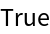
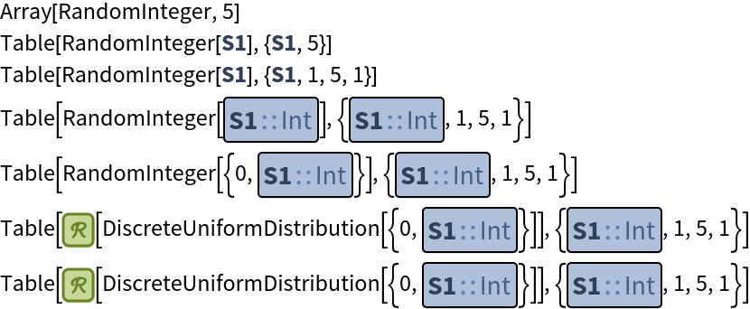
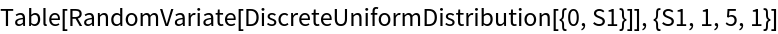
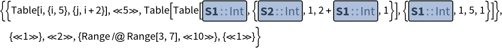
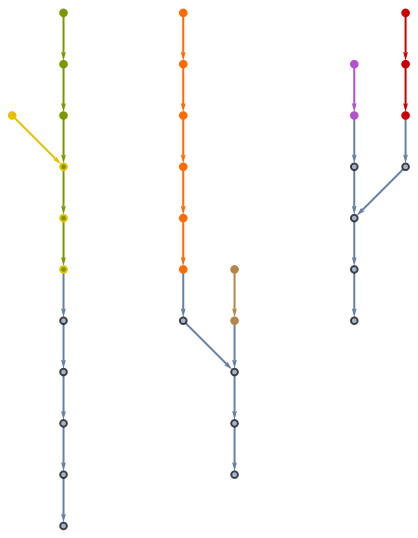

# CodeEquivalenceUtilities

<table>
<tr>
<td>

[CodeEquivalenceUtilities](https://resources.wolframcloud.com/PacletRepository/resources/Wolfram/CodeEquivalenceUtilities) is a collection of Wolfram Language functions that can be used to test if different pieces of code are equivalent without the need for evaluation.

This allows comparison of unevaluated expressions that may have non-deterministic outputs (e.g. random values, dates, etc).

This Paclet represents the underlying technology that powers several [automated code grading systems](https://www.wolfram.com/broadcast/video.php?c=104&v=1747&disp=list&ob=date&o=DESC&p=44), such as the [online exercises for EIWL](https://lab.wolframcloud.com/app/view/openEIWL?parentFilePath=elementary-introduction/01-starting-out-elementary-arithmetic-exercises.nb#sidebar=eiwl/01-starting-out-elementary-arithmetic) and [Wolfram Challenges](https://challenges.wolframcloud.com/).
</td>
<td>

</td>
</tr>
</table>

[](https://wolfr.am/Z72fzrAk) [](https://github.com/rhennigan/CodeEquivalenceUtilities/actions/workflows/Check.yml) [](https://github.com/rhennigan/CodeEquivalenceUtilities/actions/workflows/Release.yml)

## Installing CodeEquivalenceUtilities


### From the [Wolfram Paclet Repository](https://resources.wolframcloud.com/PacletRepository/)

Using Wolfram Language version 13.0 or later:

```Mathematica
PacletInstall[ResourceObject["Wolfram: CodeEquivalenceUtilities"]]
```

### Using [GitHubInstall](https://resources.wolframcloud.com/FunctionRepository/resources/GitHubInstall/)

Using Wolfram Language version 12.0 or later:

```Mathematica
ResourceFunction["GitHubInstall"]["rhennigan", "CodeEquivalenceUtilities"]
```

### From Github
The CodeEquivalenceUtilities release comes in the form of a `.paclet` file, which contains the entire package and its documentation. Download the latest release from the [GitHub repo's releases page](https://github.com/rhennigan/CodeEquivalenceUtilities/releases). To install, run the following command in the Wolfram Language:

```Mathematica
PacletInstall["/full/path/to/CodeEquivalenceUtilities.paclet"]
```

This will permanently install the CodeEquivalenceUtilities paclet. The Wolfram Language will always use the latest installed version of CodeEquivalenceUtilities. Installed versions can be enumerated using the command:

```Mathematica
PacletFind["Wolfram/CodeEquivalenceUtilities"]
```

And all versions can be uninstalled using the command:

```Mathematica
PacletUninstall["Wolfram/CodeEquivalenceUtilities"]
```

<details><summary><h2>Paclet Guide</h2></summary>

Equivalence for Wolfram Language code can be defined in many ways. The methods used by CodeEquivalenceUtilities attempt to determine intensional equivalence by transforming expressions into a canonical representation.

### Equivalence Testing

[CodeEquivalentQ](https://resources.wolframcloud.com/PacletRepository/resources/Wolfram/CodeEquivalenceUtilities/ref/CodeEquivalentQ.html) - test if two unevaluated expressions are equivalent

[EquivalenceTestData](https://resources.wolframcloud.com/PacletRepository/resources/Wolfram/CodeEquivalenceUtilities/ref/EquivalenceTestData.html) - get additional information about the equivalence test performed by 
[CodeEquivalentQ](https://resources.wolframcloud.com/PacletRepository/resources/Wolfram/CodeEquivalenceUtilities/ref/CodeEquivalentQ.html)

### Code Transformation

[ToCanonicalForm](https://resources.wolframcloud.com/PacletRepository/resources/Wolfram/CodeEquivalenceUtilities/ref/ToCanonicalForm.html) - convert an expression into a canonical representation for direct comparison

[MakeCanonicalForm](https://resources.wolframcloud.com/PacletRepository/resources/Wolfram/CodeEquivalenceUtilities/ref/MakeCanonicalForm.html) - convert to canonical form without evaluating the input

[FromCanonicalForm](https://resources.wolframcloud.com/PacletRepository/resources/Wolfram/CodeEquivalenceUtilities/ref/FromCanonicalForm.html) - convert a canonical representation back into a normal evaluatable expression

</details>

## Examples

### Basic Examples

Check if two expressions are equivalent:

```Mathematica
CodeEquivalentQ[RandomInteger /@ Range[5], Array[RandomInteger, 5]]
```


---

View the canonical representations of expressions:

```Mathematica
MakeCanonicalForm[RandomInteger /@ Range[5]]
```
<p></p>


```Mathematica
MakeCanonicalForm[Array[RandomInteger, 5]]
```


These are directly comparable:

```Mathematica
% === %%
```


<details><summary><h3>Scope</h3></summary>

Get additional information about the equivalence test:

```Mathematica
EquivalenceTestData[
    First[Rest[Range /@ Range[2^100]]],
    Part[Table[Table[j, {j, i}], {i, 2^100}], 2]
]
```


---

View the sequence of transformations used to convert an expression to its canonical form:

```Mathematica
MakeCanonicalForm[Array[RandomInteger, 5], "Trace" -> True] // Column
```



---

Convert a canonical representation to a normal expression:

```Mathematica
MakeCanonicalForm[Array[RandomInteger, 5]]
```


```Mathematica
FromCanonicalForm[%]
```


Evaluate:

```Mathematica
ReleaseHold[%]
```


</details>

<details><summary><h3>Neat Examples</h3></summary>

Here is a list of expressions, some of which are equivalent to others:

```Mathematica
expressions = {
    HoldForm[Table[i, {i, 5}, {j, i + 2}]],
    HoldForm[Array[Range, 5, 3]],
    HoldForm[Table[ConstantArray[i, i + 2], {i, 5}]],
    HoldForm[First[Rest[Range /@ Range[10]]]],
    HoldForm[Range /@ Range[3, 7]],
    HoldForm[Part[Table[Table[j, {j, i}], {i, 10}], 2]]
};
```

Find the sequence of transformations for each expression:

```Mathematica
Short[traces = Most@ToCanonicalForm[#, "Trace" -> True] & /@ expressions]
```


Generate a graph for each sequence:

```Mathematica
paths = Graph[DirectedEdge @@@ Partition[#, 2, 1]] & /@ traces
```


Combine the graphs:

```Mathematica
graph = Graph[GraphUnion @@ paths, Sequence[
   VertexLabels -> Placed["Name", Tooltip], 
    GraphLayout -> "LayeredDigraphEmbedding"]];
```

Equivalent expressions converge to the same connected component:

```Mathematica
HighlightGraph[graph, paths]
```


Group the expressions into their corresponding equivalence class:

```Mathematica
grouped = GroupBy[expressions, ToCanonicalForm]
```


```Mathematica
TableForm[KeyValueMap[Reverse@*List, grouped]]
```


</details>

## License

This project is licensed under the terms of the MIT license. See the LICENSE file in the root directory of this source tree for details.
